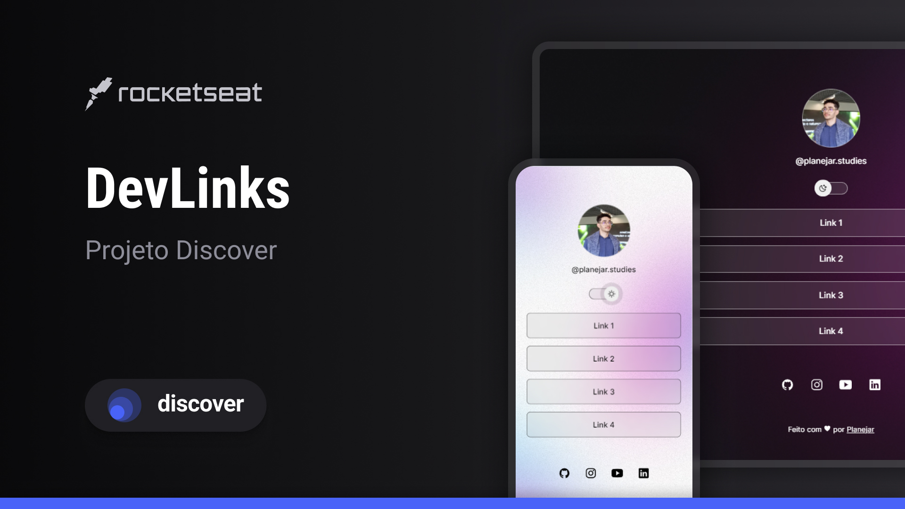

<h1 align="center"> TreeLinks </h1>

Projeto baseado no Discover, programa exclusivo e gratuito, promovido pela Rocketseat para ensino de tecnologias WEB.  
<a href="https://www.rocketseat.com.br/discover">Acesse o programa clicando aqui.</a>

  <a href="#-tecnologias">Tecnologias</a>&nbsp;&nbsp;&nbsp;|&nbsp;&nbsp;&nbsp;
  <a href="#-projeto">Projeto</a>&nbsp;&nbsp;&nbsp;|&nbsp;&nbsp;&nbsp;
  <a href="#memo-licença">Licença</a>

  

 

  

## 🚀 Tecnologias

Esse projeto foi desenvolvido com as seguintes tecnologias:

- HTML e CSS
- JavaScript
- Git e Github
- Figma

## 💻 Projeto

O TreeLinks é um agregador de links para usar como cartão de visitas online (muito popular no instagram).

- [Acesse o projeto finalizado, online](https://arthurhappx.github.io/tree-links/)

## :memo: Licença

Esse projeto está sob a licença MIT.
